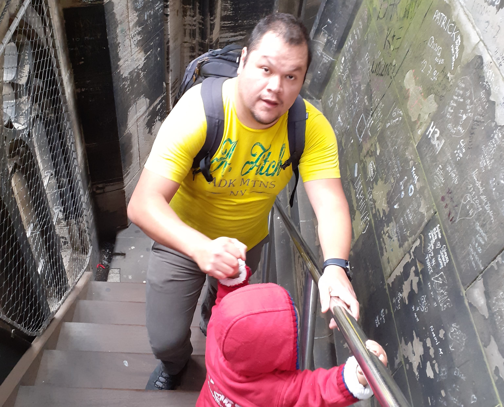

## Hi there

My name is Hugo I. Ramirez Soto. I'm a Full-Stack Software Developer, UX Designer, husband, father and baseball fanatic.

<em>-Picture taken in one of the towers at the Cologne Cathedral.</em>

Currently, I'm living in Freiburg im Breisgau, Germany, I was born and raised in Mexico City, Mexico.

I started this blog following the advice of [**@flaviocopes**](https://twitter.com/flaviocopes). I want to contribute to the community by writing my experiences as a developer and the challenges that I have faced with others. Sometimes when a developer is studying a new technology it is often easy for him or her to review a blog than study the docs of that technology because he or she knows that the blog will explain the problem in words that they can understand and also the blog might give real examples.

Besides, to fully understand a problem or technology sometimes is better to explain it to others, this gives you other perspectives and helps your brain to retain this new knowledge.

## Where I've been?

- [**Fraunhofer IPA**](https://www.ipa.fraunhofer.de/) - <em>Fullstack developer, UX designer</em>
- [**Hochshule Rhein-Waal**](https://www.hochschule-rhein-waal.de/en) - <em>Usability Engineering, M.Sc.</em>
- [**Softtek**](https://www.softtek.com/) - <em>Systems Engineer</em>
- [**BAMF**](https://bamf.com.mx/) - <em>Fullstack developer</em>
- [**Universidad Autónoma Metropolitana**](http://www.cua.uam.mx/) - <em>Information Technology, B.Sc.</em>
- [**Hochshule Hof**](https://www.hof-university.de/) - <em>Semester abroad</em>
